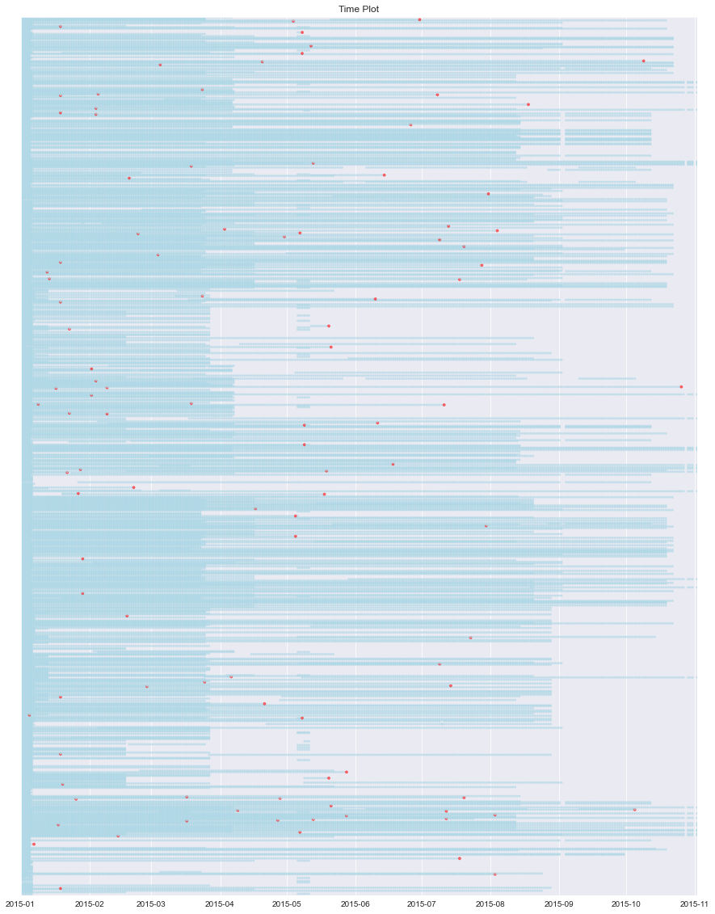
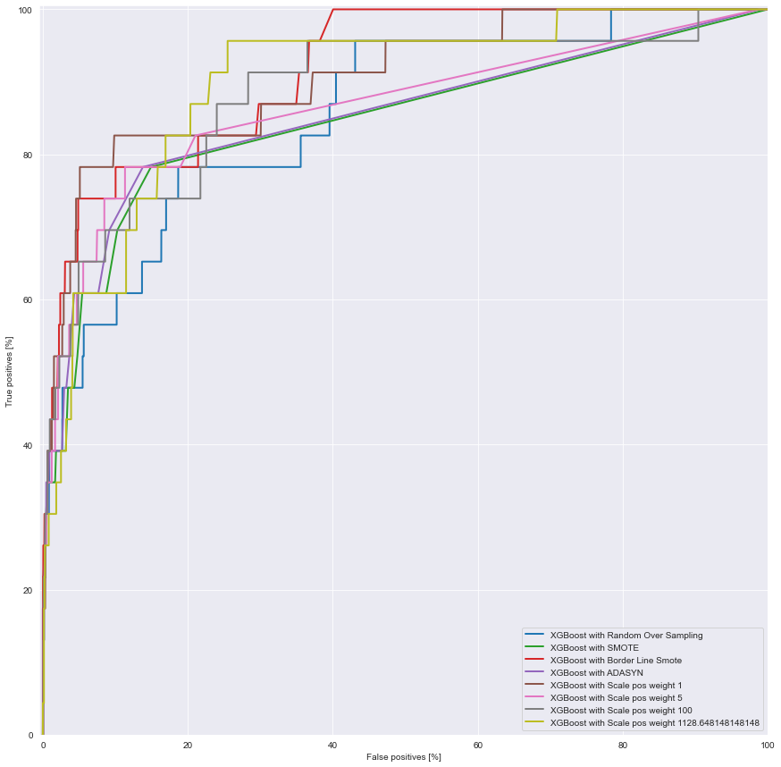

# Observations on data:

- No missing values

- Imablanced (0.09% of total positive)

- 1 duplicates rows

- Attributes 2, 3, 4, 7, 8 and 9 are highly skewed

- Attributes 2, 3, 4, 7, 8 and 9 are mostly zeros (>90%)

- Atributes 7 and 8 are the same

- Attributes 1 and 6 poorly correlated with failure

- Attribute 3 and 9 highly correlated with failure

- 1169 devices are active intermittently with different lifetime

- 304 unique days in data



# Results

As labels are highly imbalanced, we tried out two approaches:

- oversampling: using different techniques as Random Over Sampling, SMOTE, Border Line SMOTE and ADASYN

- Rescaled the weight for extra penalizing in positive labels.

We finally trained different XGBoost ensemble models using the mentioned oversampling techiques and different vales of weight scales.



## Conclusions

The selected model performs almost perfect in training data, as it manages imbalance data appropiately (thanks to BLSM oversampling). However, performance with test (unseen) data is very poor, as it 21 FP and 25 FN. More regularization and hyperparameter tunning is needed in order to avoid overfitting.

In my view, for this task FN are far more important to acess than FP, as missclassifying a device as not failure, when actually is about to fail , would incur in much cost than the viceversa, that is when we classify a device as failure when it is not (FP), incurring only in operational costs.


```

```
